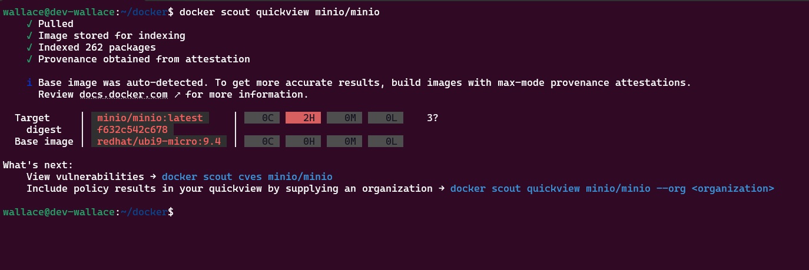
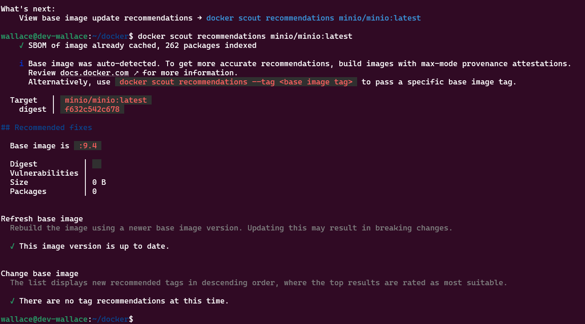

# Docker Scout
Usado para verificar vulnerabilidades nas imagens Docker

## Como instalar?
```
curl -sSfL https://raw.githubusercontent.com/docker/scout-cli/main/install.sh | sh -s --
```

## Run check
```
docker scout quickview <image-name>
```



## Verificar as CVES
```
docker scout cves <image-name>
```


## Verificar recomendações 
```
docker scout recommendations <image-name>
```



## Referências
https://github.com/docker/scout-cli


## Developer
| Desenvolvedor      | LinkedIn                                   | Email                        | Portfólio                              |
|--------------------|--------------------------------------------|------------------------------|----------------------------------------|
| Wallace Camargo    | [LinkedIn](https://www.linkedin.com/in/wallace-camargo-35b615171/) | wallacecpdg@gmail.com        | [Portfólio](https://wlcamargo.github.io/)   |


